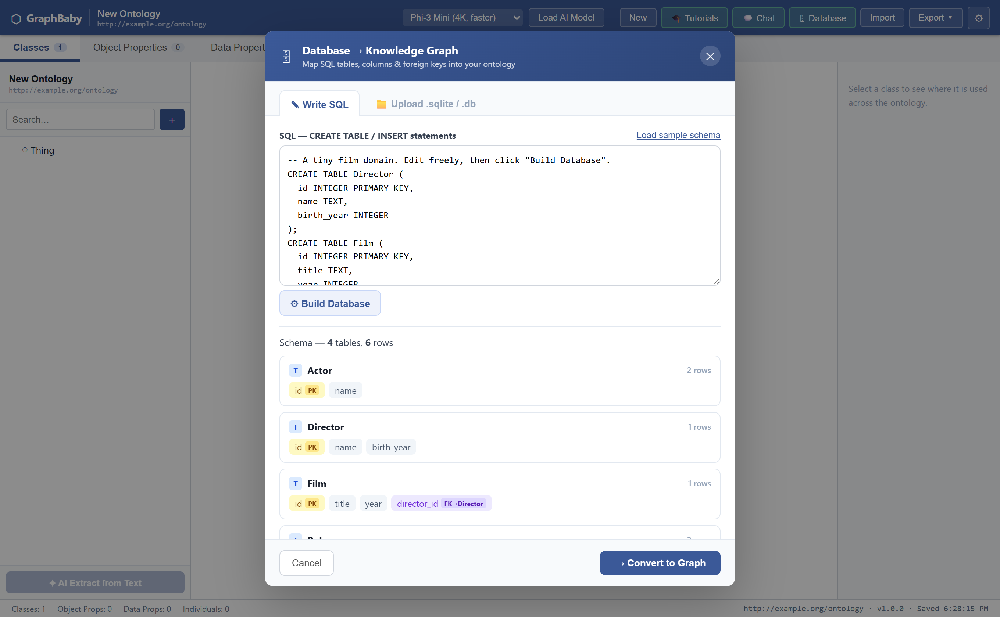
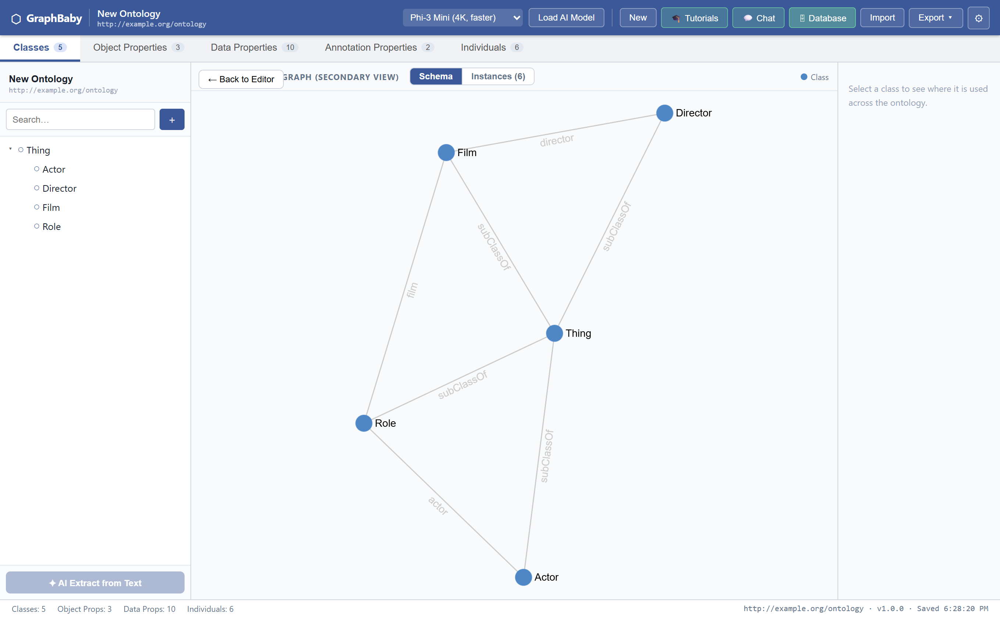
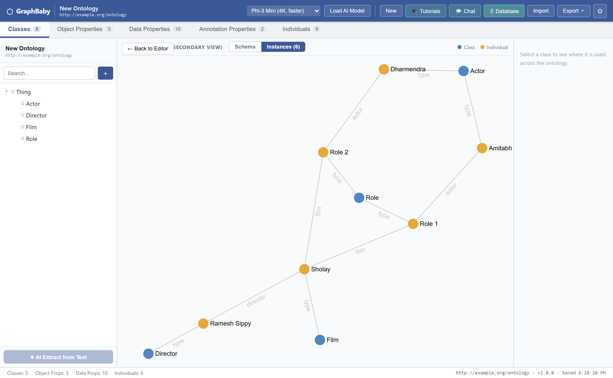
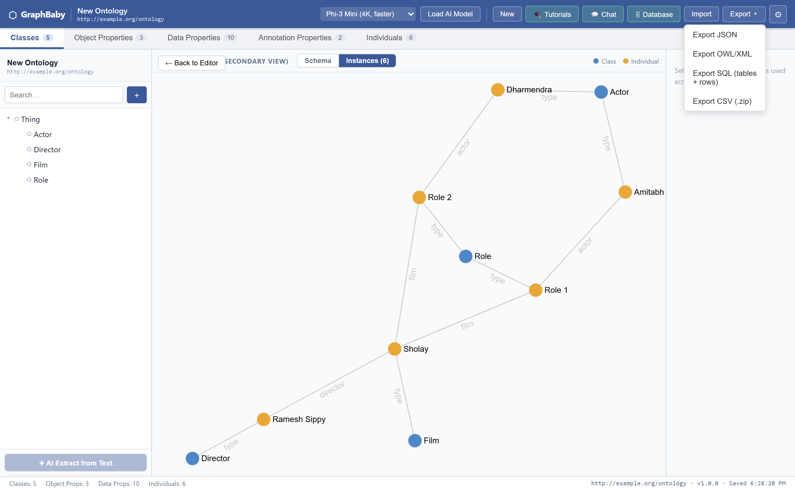
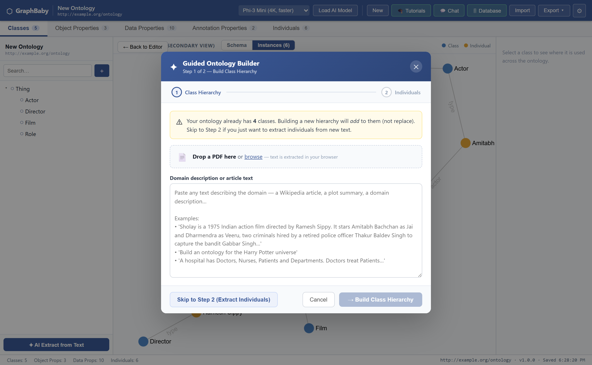

# From Databases and Documents to Knowledge Graphs

> The [first GraphBaby article](article.md) explained an ontology by analogy to a database: *the table schema is the ontology, the rows are the knowledge graph.* That was a teaching device. This follow-up turns it into a feature — GraphBaby now maps a real SQL database straight into an OWL ontology, and back again — and adds PDFs as a second on-ramp. No cloud, no model required for the database path: it all runs in a browser tab.

---

## 1. The analogy was hiding a feature

The earlier article leaned on a table to pin down the difference between an ontology and a knowledge graph:

| Database world | Semantic world | Role |
|----------------|----------------|------|
| Table schema / `CREATE TABLE` | **Ontology** | defines what *can* exist and the rules |
| Rows in the table | **Knowledge graph** | the actual records |
| `JOIN` / query | **Reasoner / traversal** | derives answers |

Read that table twice and something jumps out: if a relational schema *is* an ontology and rows *are* a knowledge graph, then the translation shouldn't need an LLM at all. A foreign key already **is** a typed relationship. A column already **is** a property with a datatype. The structure is sitting right there in the `information_schema`, waiting to be read.

So I built exactly that: a **Database → Knowledge Graph** path. Where the AI extractor *guesses* structure out of prose, this path *reads* structure that already exists — deterministically, with zero hallucination.

---

## 2. The mapping, made literal

The rules are the boring, correct kind — a "direct mapping" in the spirit of the W3C's [R2RML](https://www.w3.org/TR/r2rml/):

| Relational | → | Ontology |
|------------|---|----------|
| table | → | **Class** |
| plain column | → | **Data Property** (SQL type → `xsd:` datatype) |
| foreign key | → | **Object Property** (domain = this table, range = the referenced table) |
| row *(optional)* | → | **Individual**, with cell values as data/object-property assertions |

Open **🗄 Database** in the top bar and you can either drop a `.sqlite`/`.db` file or type SQL. GraphBaby builds the database in-browser with [sql.js](https://sql.js.org) (SQLite compiled to WASM), introspects it, and shows you the schema before committing to anything.

*The wizard reads the schema first. Four tables, six rows; primary keys are flagged, and `Film.director_id` is recognised as a foreign key pointing at `Director`. Nothing is inferred or invented — this is the database describing itself.*

---

## 3. What comes out: the schema is the ontology

Hit **Convert to Graph** and the four tables become four classes under `owl:Thing`. The foreign keys become labelled object-property edges between them. This is the **TBox** — the schema level — recovered directly from the DDL.

*The schema graph. `Film —director→ Director`, `Role —film→ Film`, `Role —actor→ Actor`: every edge is a former foreign key. The `Role` table — a classic many-to-many join table — shows up as exactly what it is, a class with two relationships.*

Flip the toggle to **Instances** and the rows arrive as **individuals** — the ABox, the knowledge graph proper. Each individual is typed by its table's class (the grey `type` edges) and wired to other individuals by the foreign-key relationships.

*The same data, one level down. `Sholay —director→ Ramesh Sippy`; `Role 1 —film→ Sholay` and `Role 1 —actor→ Amitabh Bachchan`. The join-table rows (`Role 1`, `Role 2`) reify the cast relationship into first-class nodes. This is a knowledge graph that no model wrote — it was already latent in the joins.*

The lesson the earlier article laboured to make abstract is, here, just a toggle: **Schema** shows the blueprint, **Instances** shows the building. Same ontology, two altitudes.

---

## 4. Deterministic on purpose

This path deliberately does **not** touch the LLM, and that is the point. The AI extractor's whole failure mode is hallucination — invented classes, mistyped individuals, asserted nonsense. A relational schema has none of that ambiguity: the types are declared, the relationships are enforced by constraints, the cardinalities are known. Reading it is a parsing problem, not a guessing one.

So the two on-ramps sit at opposite ends of the same spectrum:

| | AI extraction (from text) | Database mapping |
|---|---|---|
| **Input** | unstructured prose | a relational schema + rows |
| **Structure** | *inferred* by an LLM | *read* from the DDL |
| **Needs a model** | yes (WebLLM / WebGPU) | no |
| **Failure mode** | hallucination | none — it's a faithful translation |
| **You get** | a draft to review | an exact mapping |

One turns a paragraph into a *guess* at a graph; the other turns a database into a *provably faithful* graph. Most real projects want both — the messy front door and the rigorous one.

---

## 5. The mapping runs both ways

Because the correspondence is an isomorphism, it inverts. GraphBaby can take any ontology — whether you built it from text, from a tutorial, or from a database — and export it **back** to relational form: classes become `CREATE TABLE`s, data properties become typed columns, object properties become `FOREIGN KEY` constraints, and individuals become `INSERT`ed rows. Or, if you prefer flat files, one CSV per table, bundled into a `.zip`.

*Four exports, two worlds. JSON and OWL/RDF-XML for the semantic-web toolchain; SQL and CSV for the relational one. The SQL export round-trips: re-import the `.sql` GraphBaby produces and you get your tables and foreign keys back.*

That round-trip is the strongest possible statement of the analogy. It isn't "a database is *like* an ontology" — it's that, for this shared subset, they carry the same information and you can move freely between the two representations.

---

## 6. Documents, too: PDF in

Structured data is the rigorous on-ramp; most knowledge, though, still arrives as prose in files. So the text extractor now takes **PDFs** directly — drag one onto the wizard and its text is pulled out in-browser with [pdf.js](https://mozilla.github.io/pdf.js/), then fed to the same two-pass AI pipeline (draft the classes, then populate individuals under that schema).

*A drop zone above the paste box. The PDF never leaves your machine — the text is extracted locally and handed to the local model, keeping the whole "your data stays on your device" promise intact. (Scanned, image-only PDFs have no selectable text, and the tool says so rather than failing silently.)*

Between them, the two input paths cover the two shapes knowledge comes in: **already-structured** (databases, which map exactly) and **unstructured** (documents, which the AI drafts and you review).

---

## 7. Where it still stops — and why that's the same lesson

Everything the [first article](article.md) said about the honest limit still holds: GraphBaby **stores and exports** OWL axioms, it does not **reason** over them. The database path doesn't change that. Mapping a foreign key to an object property with a `domain` and `range` records the constraint; it does not run a description-logic reasoner to *entail* new facts or catch a contradiction. The inferred hierarchy is still a job for HermiT, Pellet, or ELK consuming the exported OWL.

If anything, the deterministic mapping sharpens the point. It gets you a *correct* ontology-and-graph for free — and then hands you the exact same wall: **capturing structure and reasoning over structure are two different things.** GraphBaby now has two doors into the first, from data and from documents, and still leaves the second to a real reasoner.

---

## 8. The takeaway

A relational database already contains an ontology (its schema) and a knowledge graph (its rows) — the semantics are implicit in the tables, columns, and foreign keys. GraphBaby's **Database → Graph** path makes that explicit and does it deterministically, no model in the loop; the **SQL/CSV export** proves the correspondence by running it backwards; and **PDF ingestion** brings the messy, unstructured half of the world in through the AI door. The blueprint and the building were always there in your database. This just lets you *see* them as a graph — and take them back to tables whenever you like.

---

*Built with Svelte 5, sql.js, pdf.js, Sigma.js, and WebLLM. No backend, no cloud inference — your data never leaves your device.*
