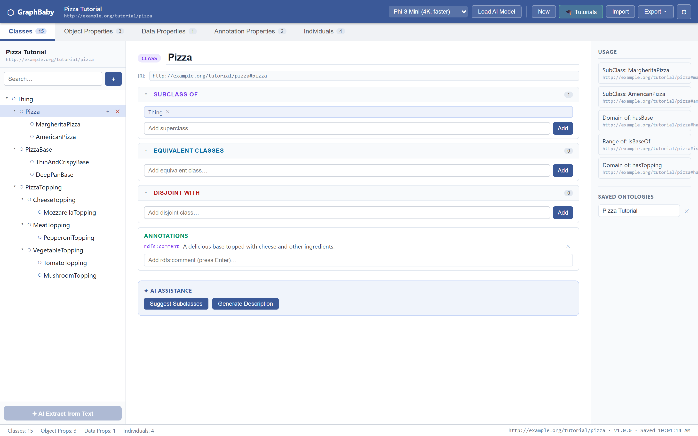
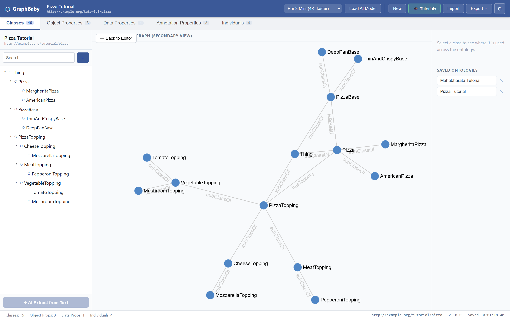
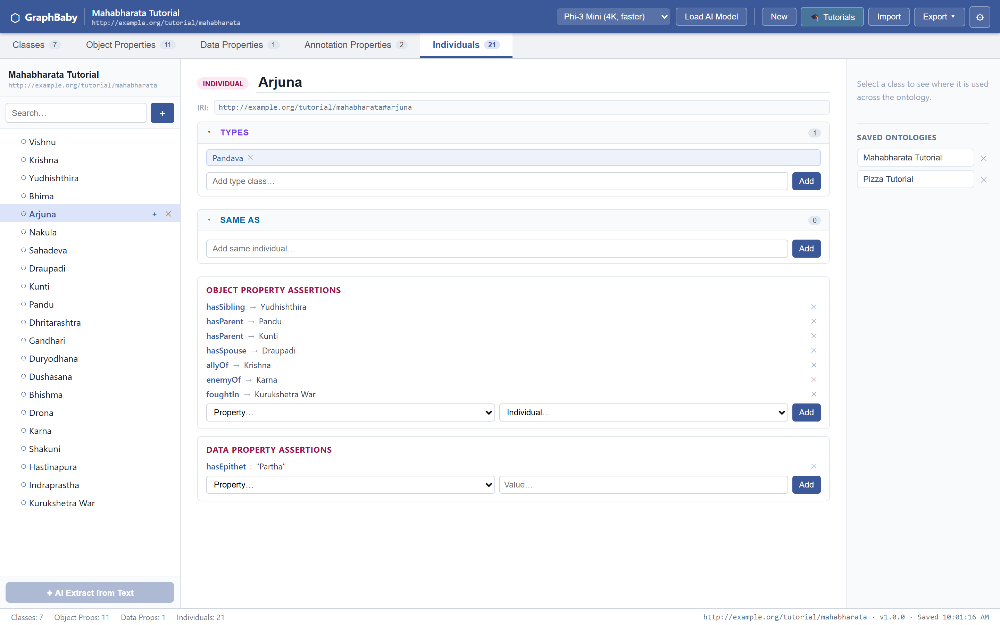
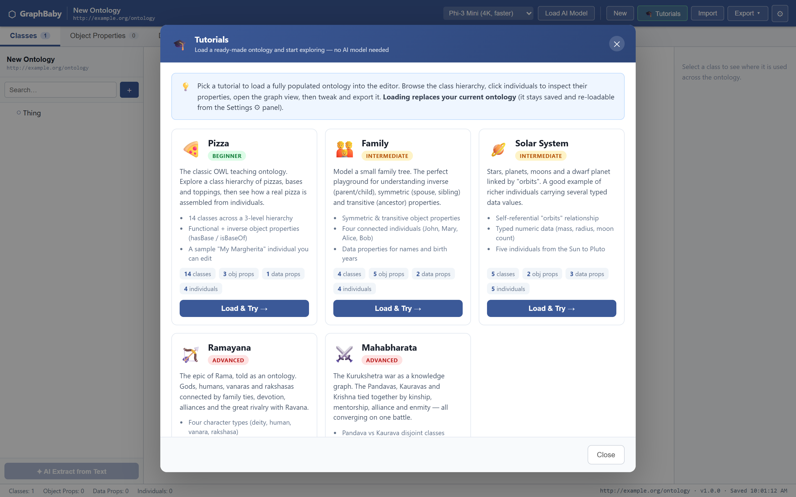
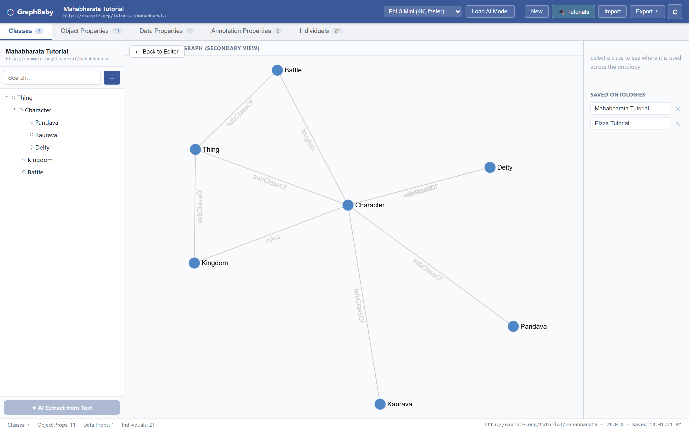

# Ontologies, Knowledge Graphs, and Artificial Intelligence

> **Ontologies** and **knowledge graphs** are decades-old ideas that most people still mix up. **Artificial intelligence** is the new force reshaping both — and with **WebLLM**, it now runs in a browser tab. Here's how the three fit together.

---

## 1. An old idea meets a new engine

**Ontologies** and **knowledge graphs** come out of the semantic-web world, and they are constantly confused with each other — people say "knowledge graph" when they mean ontology, and "ontology" when they just mean a diagram with arrows. The two are genuinely different things, and the difference is the first thing this article pins down.

**Artificial intelligence** isn't a third synonym in that mix — it's the new force acting on both. For decades, building a knowledge graph meant armies of human curators or brittle hand-tuned extractors, and authoring an ontology meant a specialist hunched over a formal editor. Large language models change that: feed an LLM a paragraph and it will hand you back entities and relationships in seconds. The old, painstaking disciplines suddenly have a fast, sloppy, surprisingly capable new engine.

**[WebLLM](https://github.com/mlc-ai/web-llm)** makes the shift almost absurd: it runs that LLM *entirely in your browser* — no server, no cloud inference, no data leaving your machine. The barrier to turning text into a graph drops to a single paste-and-click.

I wanted to make the *fundamentals* of ontologies and knowledge graphs easier to grasp — not by reading another definition, but by watching them take shape from real text. So I built a small experimental tool, **GraphBaby**, to do exactly that: paste in text, and a local LLM drafts a real **OWL ontology** — classes, properties, and individuals — which you can then edit, browse as a hierarchy, visualise as a graph, and export. It puts all three in one place: the AI doing the extraction, the ontology supplying the rules, and the individuals that populate it forming a knowledge graph. Where it deliberately *stops* turns out to be just as instructive as what it does — but more on that later.

This article uses that little experiment to untangle the three properly. Let's start at the foundation.


*GraphBaby's three-pane editor — the class tree (left), the entity editor with its axioms (centre), and a live usage panel (right). Shown here with the bundled **Pizza** tutorial ontology loaded.*

---

## 2. What is an ontology?

An **ontology** is a formal, explicit specification of the *concepts* in a domain and the *rules* that govern how those concepts relate. It is the **schema of meaning** — the blueprint, not the building.

Borrowed from philosophy (where "ontology" is the study of *what exists*), in computer science it answers three questions about a domain:

1. **What kinds of things exist?** (classes / types) — e.g. `Person`, `Organization`, `Disease`, `Medication`.
2. **How can they relate?** (properties / relationships) — e.g. a `Person` can `worksAt` an `Organization`; a `Medication` `treats` a `Disease`.
3. **What rules must hold?** (axioms / constraints) — e.g. "every `Patient` *is a* `Person`," "`treats` only connects a `Medication` to a `Disease`," "a `Person` has exactly one `dateOfBirth`."

### The defining feature: rules you can reason over

The thing that makes an ontology an ontology — and not just a labelled diagram — is that it encodes **logic a machine can reason with**. If your ontology states:

- `Cardiologist` is a subclass of `Doctor`
- `Doctor` is a subclass of `Person`

…then a reasoner can *infer*, with no extra data, that every Cardiologist is a Person. Nobody had to write that fact down. That capacity for **inference** is the heart of the concept.

Ontologies are typically written in formal languages:

| Language | What it gives you |
|----------|-------------------|
| **RDFS** | basic classes, subclasses, properties |
| **OWL** (Web Ontology Language) | rich logic: cardinality, disjointness, transitivity, equivalence |
| **SHACL** | shape constraints / validation rules |

A tiny ontology fragment in Turtle (RDF syntax) looks like this:

```turtle
:Doctor      rdfs:subClassOf :Person .
:Cardiologist rdfs:subClassOf :Doctor .

:treats   rdfs:domain :Medication ;
          rdfs:range  :Disease .
```

This says nothing about any *specific* doctor. It describes the **shape of reality** for the medical domain. That is an ontology: **the vocabulary and the rules, divorced from any particular data.**


*The schema, visualised: GraphBaby's graph view shows the **class hierarchy** alone — `Pizza`, `PizzaBase` and `PizzaTopping` branching into subclasses, linked by `subClassOf` and property edges. Not a single concrete pizza in sight; this is the blueprint.*

---

## 3. What is a knowledge graph?

A **knowledge graph** is a network of **real, concrete facts** represented as a graph: nodes (entities) connected by edges (relationships). It is the **data**, the populated instance — the building, not the blueprint.

Facts are stored as **triples**:

```
(subject) --[predicate]--> (object)
```

For example:

```
(Albert Einstein) --[developed]--> (Theory of Relativity)
(Albert Einstein) --[worked_at]--> (Princeton University)
```

A knowledge graph answers questions like *"Where did Einstein work?"* by traversing edges. It is **specific, instance-level, and grows by adding more facts.** Google's Knowledge Graph (the info boxes in search results), Wikidata, and enterprise customer-360 graphs are all knowledge graphs: huge collections of concrete entities and relationships.

In GraphBaby these facts live as **individuals** — `Einstein`, `Princeton` — each typed by a class from the ontology and linked by the ontology's object properties. The bare triple is the *idea*; the typed, schema-bound individual is what the tool actually stores. We'll see why that distinction matters in a moment.


*An individual is where the facts live. Here `Arjuna` (from the bundled **Mahabharata** tutorial — more on those below) is typed as a `Pandava` and wired up with concrete assertions: `hasParent → Kunti`, `hasSpouse → Draupadi`, `allyOf → Krishna`, `enemyOf → Karna`, `foughtIn → Kurukshetra War`. Every edge points at another real individual; this is the knowledge graph.*

---

## 4. Where artificial intelligence enters

Here is the part that makes GraphBaby a 2026 project rather than a 2006 one.

Classically, the ontology came first — painstakingly hand-authored by a specialist in a formal ontology editor — and only then was data poured into its mould by human curators or brittle rule-based extractors. Both halves were slow.

GraphBaby hands *both* halves to the AI, in the right order. A local large language model — running entirely in the browser via [WebLLM](https://github.com/mlc-ai/web-llm) on WebGPU — does the work in two passes, and the order is the whole point:

1. **First, draft the schema.** The system prompt is literally *"You are an OWL ontology class hierarchy designer."* The model reads the text and proposes the **classes** and their `subClassOf` hierarchy — the TBox, the ontology itself.
2. **Then, populate it — under constraint.** A second prompt — *"You are an OWL individual extractor… DO NOT invent new classes"* — feeds the model the *already-approved* classes and properties and asks it to extract **individuals** that fit them. The schema from step 1 becomes the leash on step 2.

This is the crux of the experiment, and it cuts both ways:

- **AI makes ontologies cheap.** What used to need an ontologist *and* an NLP team is now a paste-and-click. The barrier to a *first* ontology collapses to near zero.
- **AI on its own is unreliable.** Left unconstrained, the model invents classes, mislabels types, and asserts nonsense relationships. GraphBaby's answer is to let the AI's own first-pass *ontology* discipline its second-pass *extraction* — the schema is the guardrail.

And that is exactly how the three concepts revealed their relationship to me: **the AI is the engine, the ontology is the guardrail, and the knowledge graph of individuals is what comes out when you point the first through the second.**

---

## 5. The core difference, stated plainly

> **An ontology is the *schema*. A knowledge graph is the *data*. AI is the *engine* that can produce (or pollute) the data.**
>
> The ontology says *"a Person can work at an Organization."*
> The knowledge graph says *"Einstein works at Princeton."*
> The AI is what turned the sentence "Einstein worked at Princeton" into that triple — guess and all.

A helpful analogy from databases:

| Database world | Semantic world | Role |
|----------------|----------------|------|
| Table schema / `CREATE TABLE` | **Ontology** | defines what *can* exist and the rules |
| Rows in the table | **Knowledge graph** | the actual records |
| `JOIN` / query | **Reasoner / traversal** | derives answers |
| The app writing rows | **AI extraction** | produces the records from raw input |

And the crucial relationship between the first two:

- A knowledge graph **can** be built on top of an ontology (then it's a "semantically rich" or "ontology-backed" knowledge graph — it can be validated and reasoned over). *This is what GraphBaby produces: every individual is typed by an ontology class.*
- A knowledge graph **can also exist without one** — just nodes and edges with free-form labels, no enforced rules. These are sometimes called "labelled property graphs," and they're what you get from a pure text-to-graph extractor with no schema.

| Dimension | Ontology | Knowledge Graph | AI (LLM) |
|-----------|----------|-----------------|----------|
| **What it is** | Schema of concepts + rules | Network of concrete facts | A model that maps text → structure |
| **Level** | Class / type level | Instance / data level | The transformation step |
| **Example** | "A Medication *treats* a Disease" | "Aspirin *treats* Headache" | Reads "aspirin helps with headaches" → emits that edge |
| **Primary value** | Consistency + inference | Connected facts to query | Speed + flexibility |
| **Failure mode** | Rigid, slow to author | Messy without a schema | Hallucination, no guarantees |
| **Analogy** | Blueprint / grammar | Building / sentence | The author who writes the sentence |

---

## 6. What GraphBaby actually is — and what running the experiment taught me

When I started, I expected to build a loose text-to-graph sketcher. What the experiment pulled me toward was something stricter: GraphBaby ended up being an **AI-assisted OWL ontology editor** — closer to a browser-based ontology editor with an AI front-end than to a casual graph doodler. Here is the pipeline, mapped to the three concepts:

1. **Input** — paste unstructured text.
2. **Extract the ontology (AI)** — the wizard's first pass drafts the **class hierarchy**; you review and approve it.
3. **Populate it (AI, constrained)** — the second pass extracts **individuals** that may only use the approved classes and properties.
4. **Hand-edit the OWL** — dedicated editors for classes, object properties, data properties, individuals, and **axioms** (`equivalentClasses`, `disjointWith`, property characteristics like `Transitive`/`Symmetric`/`Functional`). A live hierarchy tree shows `owl:Thing` at the root with everything beneath it.
5. **Visualise & export** — render the graph with [Sigma.js](https://www.sigmajs.org) + [Graphology](https://graphology.github.io), persist to IndexedDB, and export to **JSON or OWL/RDF-XML** (real `owl:Class`, `owl:ObjectProperty`, `rdfs:subClassOf` you could open in any standard ontology tool).

So this is *not* a free-floating bag of nodes and edges. Every entity is a typed OWL construct with an IRI. Object properties carry `domain` and `range`. The model captures the genuine axioms — disjointness, equivalence, transitivity, functionality — that separate an ontology from a doodle. The internal type isn't `{ id, label }`; it's a full `Ontology` with `classes`, `objectProperties`, `dataProperties`, `annotationProperties`, and `individuals`.

### The honest limit: it *stores* the logic, it doesn't *reason* over it

Here's where the experiment actually stops — and it's the most interesting boundary of all. GraphBaby will happily let you *declare* that `treats` is `Functional`, or that `Doctor` and `Patient` are `disjointWith` each other. It stores those axioms and exports them. But it does **not run a description-logic reasoner**: it won't *infer* that every Cardiologist is therefore a Person, and it won't flag you if you assert something that contradicts a disjointness axiom. The hierarchy you see is the one that was *asserted*, never an *inferred* one.

That gap is the whole lesson. **Capturing an ontology and reasoning over an ontology are two different things** — and a browser LLM, it turns out, is great at the first and does nothing for the second. The axioms are all dressed up with nowhere to go until a real reasoner (HermiT, Pellet, ELK) consumes the exported OWL.

### Manual vs. AI-assisted authoring

Traditional ontology editors are where humans *carefully, manually* author ontologies and run reasoners to check consistency. GraphBaby keeps the same OWL model and editing panels but swaps manual authoring for AI extraction — and leaves the reasoner out:

| | Traditional ontology editor | GraphBaby |
|---|---------|-----------|
| **First draft** | Human, manual, formal | AI, from plain text |
| **Refinement** | Manual OWL editing | Manual OWL editing *and* AI suggestions |
| **Model** | Full OWL/RDF | OWL-lite (classes, properties, individuals, core axioms) |
| **Reasoning** | Full DL inference (HermiT, Pellet…) | None — axioms stored & exported, not entailed |
| **Barrier to entry** | High | Paste text, click a button |
| **Runs** | Desktop Java app | 100% in a browser tab |

The trade I actually made wasn't "drop the ontology for a loose graph." It was "keep the ontology, automate the tedious authoring with an LLM, and stop short of the reasoner."

### What's left to close the loop

The natural next steps are the ones that turn a *stored* ontology into a *reasoning* one:

- **An in-browser reasoner** — materialise the inferred hierarchy, check consistency, catch disjointness violations. This is the missing third leg.
- **Domain ontology plugins** — start from a vetted schema (medical, legal, academic) so the AI extends a trusted ontology rather than inventing one each time.
- **Multi-document merging** — entity resolution across texts, far more reliable when the ontology says two individuals are the same *kind* of thing.

Each step moves from "the AI drafted an ontology" toward "the ontology actively governs and corrects the data." That arc — from *captured* to *enforced* — is the whole reason the project is interesting to me.

---

## 7. Try it without typing a word: the tutorial ontologies

Pasting text is the headline feature — but it assumes you already *have* the text, and a loaded model. To make the *ideas* explorable in a single click, GraphBaby ships a set of **prepopulated tutorial ontologies**. Open **🎓 Tutorials**, pick one, and a complete, self-consistent OWL ontology drops straight into the editor: no model download, no pasting, nothing to set up.


*Five ready-made ontologies, from a one-concept warm-up to the full cast of an epic — each loads in one click, with no AI model required.*

They climb in difficulty on purpose:

- **Pizza** — the canonical OWL teaching ontology: a clean three-level class hierarchy with *functional* and *inverse* properties.
- **Family** — the textbook home of *symmetric* (`hasSpouse`, `hasSibling`), *inverse* (`hasParent`/`hasChild`) and *transitive* (`hasAncestor`) properties.
- **Solar System** — richer individuals carrying typed numeric data (mass, radius, moon count) and a self-referential `orbits` relationship.
- **Ramayana** and **Mahabharata** — the two great Indian epics, modelled as knowledge graphs. Here the **individuals** are the whole point: deities, humans, vanaras and rakshasas (or Pandavas, Kauravas and Krishna) bound together by family, devotion, alliance and rivalry.

The epics are where the ontology-versus-knowledge-graph distinction stops being abstract. The **classes** stay a tidy handful — `Character` splitting into `Pandava`, `Kaurava` and `Deity`, plus `Kingdom` and `Battle` — yet those few classes *type* a dense web of **individuals**: the twenty-one figures of the Mahabharata all the way down to the `Kurukshetra War` they converge on.


*Six classes govern the entire epic. The schema is small; the graph of individuals it constrains is large — exactly the split this whole article is about.*

Every tutorial is the genuine `Ontology` structure, so the moment one loads you can edit a class, add an axiom, visualise the graph, or export it to OWL/RDF-XML and open it in a standard tool like Protégé. They are the fastest way to *see* the three concepts in motion before you ever bring your own text.

---

## 8. When do you actually need which?

A practical decision guide from building this:

**A plain knowledge graph (no schema) is enough when you want to:**
- Explore connections in a body of text fast
- Build a quick mental map of a topic
- Power a "related items" feature
- Move fast and tolerate some messiness

→ *A pure text-to-graph extractor will do.*

**You want a real ontology underneath when you need to:**
- Type and constrain your data so the AI can't assert nonsense
- Guarantee consistency across many documents or sources
- Share an unambiguous vocabulary across teams (interoperability)
- Export to standards (OWL/RDF) that other tools can consume
- Operate in domains where structure matters (healthcare, legal, research)

→ *This is GraphBaby's actual sweet spot — and the home turf of traditional ontology editors.*

**You additionally need a reasoner when you need to:**
- *Infer* facts nobody wrote down ("find all the cardiologists")
- Validate that asserted facts don't violate the axioms
- Detect inconsistency automatically

→ *This is the one piece GraphBaby leaves to an external OWL reasoner.*

The mature systems use **all three**: an ontology defines the rules, an AI populates it at scale, and a reasoner keeps the result honest. GraphBaby nails the first two and stops cleanly at the third.

---

## 9. The one-paragraph takeaway

An **ontology** is the formal schema of a domain — the classes, allowed relationships, and logical rules a machine can *reason* over. A **knowledge graph** is the populated data — concrete entities and the facts linking them. **Artificial intelligence** is the engine that can now turn raw text into *both* in seconds — brilliantly, and without any built-in guarantee of being right. I built **GraphBaby** to put all three in one browser tab and watch them interchange, and the surprise was how far an in-browser LLM gets: it drafts a genuine OWL ontology, then fills it with typed individuals that obey it. Where it stops — *storing* axioms but not *reasoning* over them — is exactly the line between an ontology you can read and an ontology that thinks. The blueprint, the building, and the machine that pours the concrete: you only really see where each one ends once you've watched a single tool try to be all three.

---

*Built with Svelte 5, Sigma.js, and WebLLM. No backend, no cloud inference — your text never leaves your device.*
